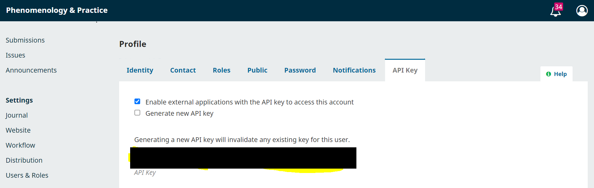

# 1. Overview

The objective of this project is to periodically generate statistical reports of OJS journals hosted the University of Alberta Library.

To achieve the above goal, we leverage the Application Programming Interface (API) offered by OJS and take advantage of
the programming power offered by the Python program language. 


# 2. Requirements

The program is written in **Python** and requires the **Requests**, **Pandas**, and **OpenPyxl** libraries.

Currently, we recommend running the program in MacOS or Linux.

You will also need a .csv file that lists your journals, following this format:

| journal_title | journal_abbr | base_url | api_key |
|:---|:---|:---|:---|:---|
|Phenomenology and Practice | pandpr | https://journals.library.ualberta.ca/pandpr/index.php/pandpr | eyJ0eXAiOiJKV1QiLCJhbGciOiJIUzI1NiJ9.IjUyYjRjMGNlYTIzNWRiZmU5Zjg5NmM0MzM3YzM1NmUzZDg4Y2I2ZjMi.lRo3cES3LKF5SE_ZTHZe90KTfsNtMGhipIzXCrMOZes |

***journal_title:*** Title of the journal.
***journal_abbr:*** Abbreviated title.
***base_url:*** URL of the journal's homepage.
***api_key (token):*** API key corresponding to the journal. This is configured in OJS as shown:




# 3. Program Execution

The command pattern is:

```
python3 quarterly_stats.py [csv_file] [start_date] [end_date] [start_index] [end_index]
```

***csv_file:*** The name/path of your csv list of journals.
***start_date*** and ***end_date***: The reporting period. Dates are in YYYY-MM-DD format.
***start_index*** and ***end_index***: Optional. Used to slice a section of the journal list, if you do not want to report on all journals in the list.

For example:

```
python3 quarterly_stats.py my_journals.csv 2025-01-01 2025-03-31 0 10
```

will produce reports for the first 10 journals in my_journals.csv.

# 4. Output

The program will produce an Excel spreadsheet report for each journal that is reported on. The naming convention is [journal_abbr]_[start_date]_quarterly_report.xlsx. They will appear in the reports folder.

```
# 5. Resources

- [OJS API Document for Version 3.x.x](./files/ojs_api_3.0.0.json)
